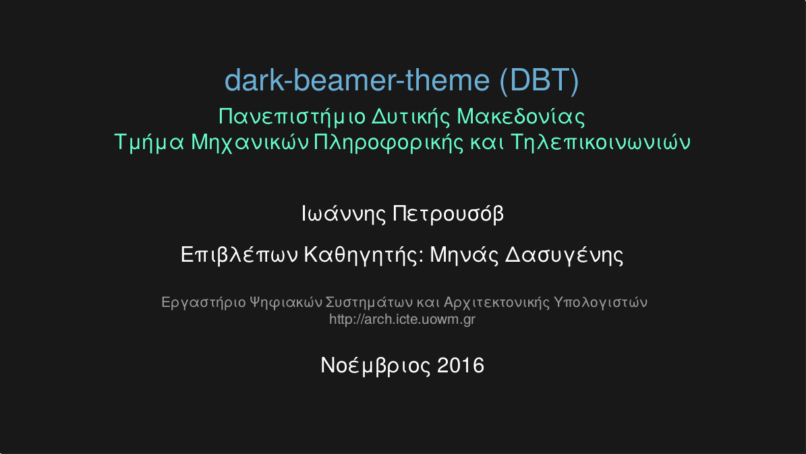

# dark-beamer-theme (DBT)

A dark minimalist LaTex Beamer theme.

## How to use

To build the example run

>make

A demo.pdf is generated.

Start creating your own presentation by modifying the demo.tex file.

## Actual thesis presentation in Greek

https://speakerdeck.com/gpetrousov/equation-parser-presentation

## Feedback

I'm not a Beamer expert so advices will be more than welcome!

Thumbs up to the original author
